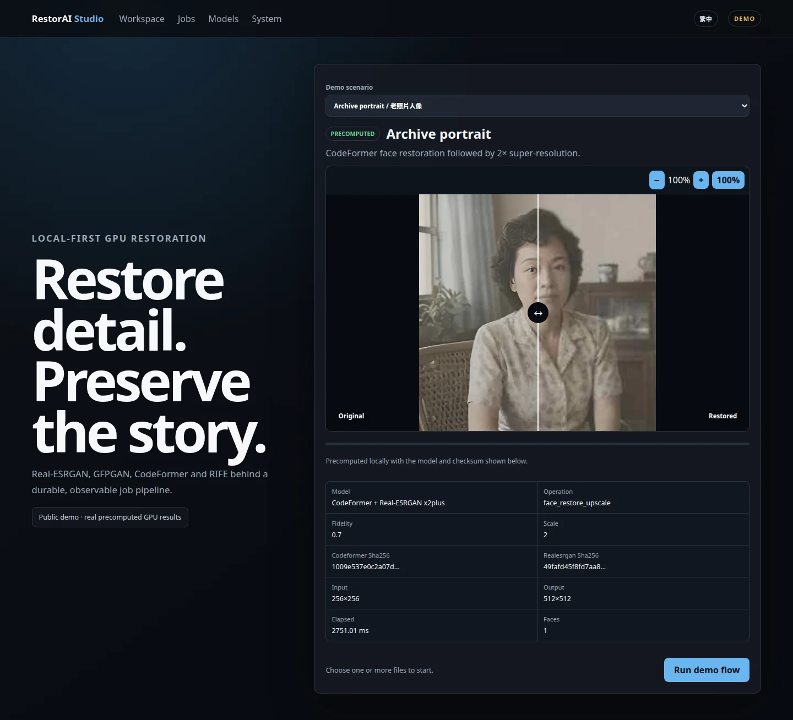
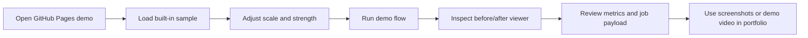
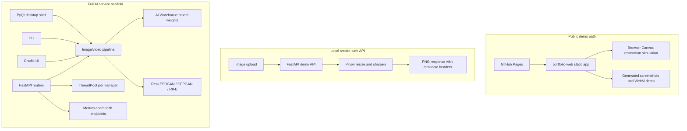
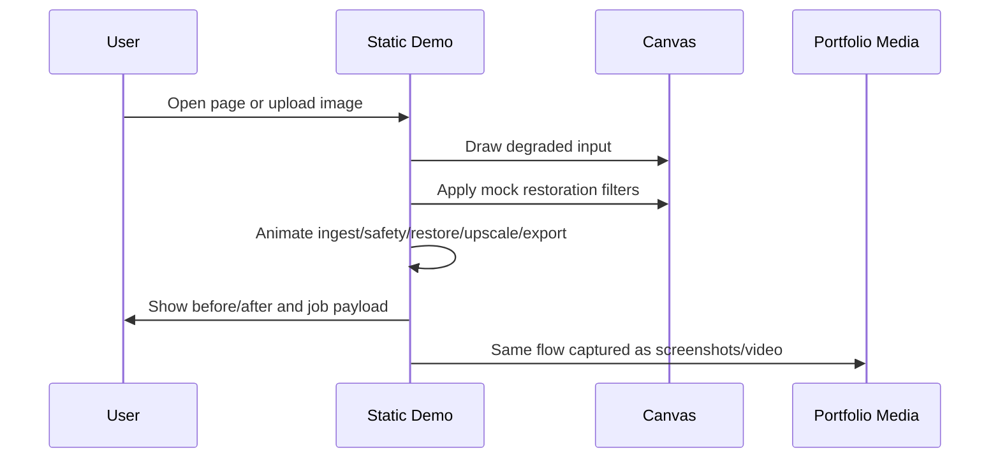
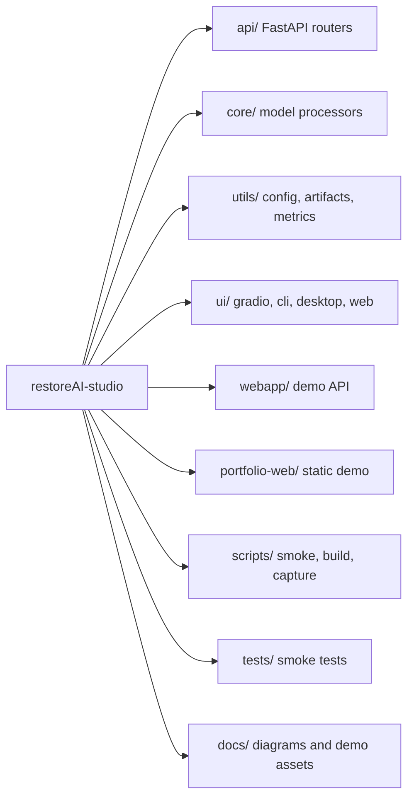
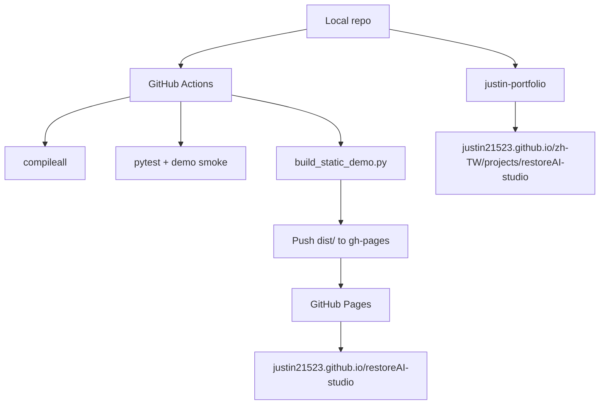
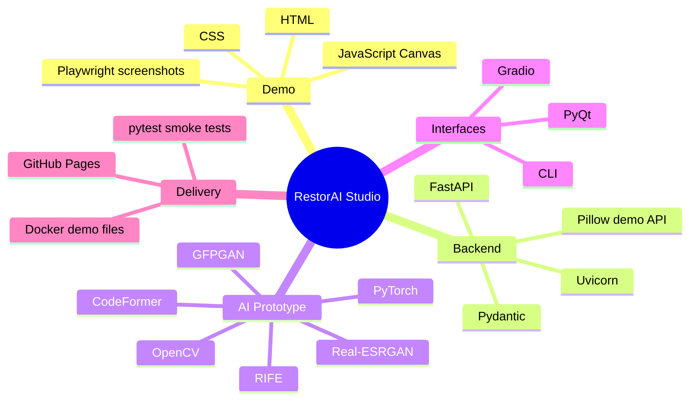

# RestorAI Studio

AI image restoration and super-resolution studio with a portfolio-safe interactive demo.

[Live demo](https://justin21523.github.io/restoreAI-studio/) · [Portfolio page](https://justin21523.github.io/zh-TW/projects/restoreAI-studio/) · [Demo video](docs/demo/demo-tour.webm)



## Project Snapshot

| Area | Status | Notes |
| --- | --- | --- |
| Product goal | Portfolio-ready prototype | Image restoration workspace for upscaling, face cleanup, batch/job flow, and model-serving architecture. |
| Public demo | Stable | Static Canvas demo on GitHub Pages; no GPU, model weights, or backend required. |
| Local demo API | Stable smoke path | FastAPI + Pillow endpoint in `webapp/main.py` for upload/upscale smoke tests. |
| Full AI backend | Prototype scaffold | FastAPI routers, Gradio, CLI, PyQt, model warehouse, Real-ESRGAN/GFPGAN/RIFE adapters exist, but true model mode still needs dependency and weight hardening. |
| Tests/build | Smoke verified | `compileall`, pytest smoke tests, demo API smoke, and static build are part of CI. |
| Deployment | GitHub Pages | `.github/workflows/pages.yml` builds `dist/` and publishes it to the legacy `gh-pages` branch. |

## Demo Flow

The first screen is the product itself: an image restoration workbench with sample scenarios, upload, restoration controls, before/after comparison, pipeline status, and job payload.



## What Is Implemented

| Layer | Implemented |
| --- | --- |
| Static demo | Canvas-generated before/after visuals, scenario switcher, upload support, pipeline animation, debug payload, responsive layout. |
| Demo API | `GET /api/v1/health`, `POST /api/v1/upscale`; deterministic Pillow resize + sharpen path. |
| Backend scaffold | FastAPI app, modular routers, middleware, metrics hooks, history/export/admin/job routes, model warehouse config. |
| Model adapters | Real-ESRGAN processor is the most complete; GFPGAN/RIFE remain scaffolded. |
| Interfaces | Static web demo, FastAPI API, Gradio shell, CLI shell, PyQt shell. |
| Assets | Cover image, desktop screenshot, pipeline screenshot, mobile screenshot, WebM tour video. |
| CI | Python compile check, pytest smoke tests, demo API smoke, static demo build, Pages deploy. |

## Architecture



## Data Flow



## Module Organization



## Deployment View



## Technology Stack



## Quick Start

```bash
python -m venv .venv
source .venv/bin/activate
pip install -r docker/requirements.demo.txt pytest httpx playwright
```

Run the static demo locally:

```bash
python scripts/build_static_demo.py
python -m http.server 8080 -d dist
```

Run the demo API:

```bash
uvicorn webapp.main:app --host 127.0.0.1 --port 8000
curl http://127.0.0.1:8000/api/v1/health
```

Run verification:

```bash
python -m compileall -q api core utils scripts ui webapp
python -m pytest -q
python scripts/smoke_demo.py
python scripts/build_static_demo.py --check
```

Regenerate portfolio media:

```bash
python scripts/capture_demo_assets.py
```

## Demo Scenarios

| Scenario | What it shows | Interview angle |
| --- | --- | --- |
| Archive photo restore | Noisy historical image cleanup and 4x output metadata | Product thinking: old-photo restoration workflow. |
| Portrait face cleanup | Face-oriented enhancement controls | AI UX: strength control, safety step, explainable job payload. |
| Product detail upscale | Detail-preserving product crop | Practical use case: e-commerce image quality improvement. |
| Upload mode | User-provided image rendered through the same viewer | Workflow completeness without server dependency. |

## API Smoke Contract

| Endpoint | Purpose | Stable for CI |
| --- | --- | --- |
| `GET /api/v1/health` | Returns demo health and mode | Yes |
| `POST /api/v1/upscale` | Accepts image file, scale, method, sharpen; returns PNG | Yes |

Example:

```bash
curl -F "file=@sample.png" \
  -F "scale=2" \
  -F "method=bicubic" \
  -F "sharpen=true" \
  http://127.0.0.1:8000/api/v1/upscale --output out.png
```

## Interview Highlights

| Highlight | Why it matters |
| --- | --- |
| Mock-safe public demo | The project can be evaluated without GPU, large weights, or private infrastructure. |
| Clear prototype honesty | README separates stable demo paths from unfinished true-model scaffold. |
| Multi-interface architecture | Shows backend/API/UI/CLI/desktop decomposition around a shared restoration pipeline idea. |
| CI-backed static deployment | GitHub Pages only publishes after compile, tests, smoke, and static build pass. |
| Reproducible media pipeline | Screenshots and video are generated from the real demo page, not manually assembled. |

## Risks And Next Steps

| Risk | Current handling | Next step |
| --- | --- | --- |
| True model mode needs heavyweight dependencies and model files | Public demo uses Canvas; local API uses Pillow | Pin production deps and add model availability tests. |
| Several original scaffold modules are incomplete | README labels them as prototype scaffold | Complete `core.pipeline`, GFPGAN, RIFE, and shared model lifecycle. |
| Full backend has legacy/unused routes | Smoke tests target stable demo contract | Consolidate API routers around one production contract. |
| GPU availability varies | Demo path is CPU/browser safe | Add explicit CPU fallback for real inference mode. |

## Repository Map

| Path | Role |
| --- | --- |
| `portfolio-web/` | Static public demo source. |
| `webapp/main.py` | Mock-safe FastAPI demo API. |
| `scripts/build_static_demo.py` | Builds/validates GitHub Pages output. |
| `scripts/smoke_demo.py` | API smoke test. |
| `scripts/capture_demo_assets.py` | Generates cover, screenshots, and demo video. |
| `docs/demo/` | Portfolio media assets. |
| `api/`, `core/`, `ui/`, `utils/` | Original AI restoration service scaffold. |

## Deployment

GitHub Pages is the primary public deployment. The repository is configured for legacy Pages from the `gh-pages` branch. On push to `main`, `.github/workflows/pages.yml` runs:

1. Install smoke dependencies.
2. Compile Python modules.
3. Run pytest and demo API smoke.
4. Build `dist/` from `portfolio-web/`.
5. Publish `dist/` to the `gh-pages` branch.

Docker demo files are also included for environments that want a static Nginx frontend plus the `webapp` FastAPI demo backend.
